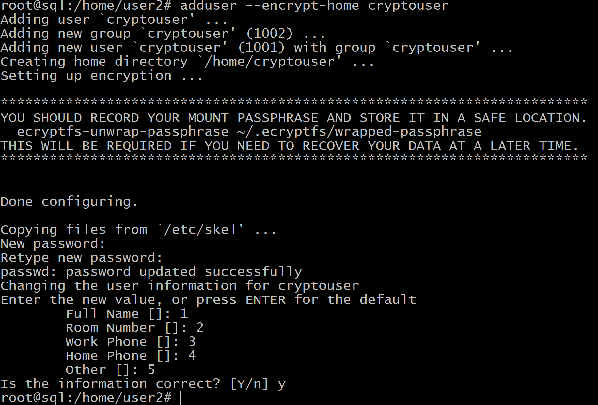
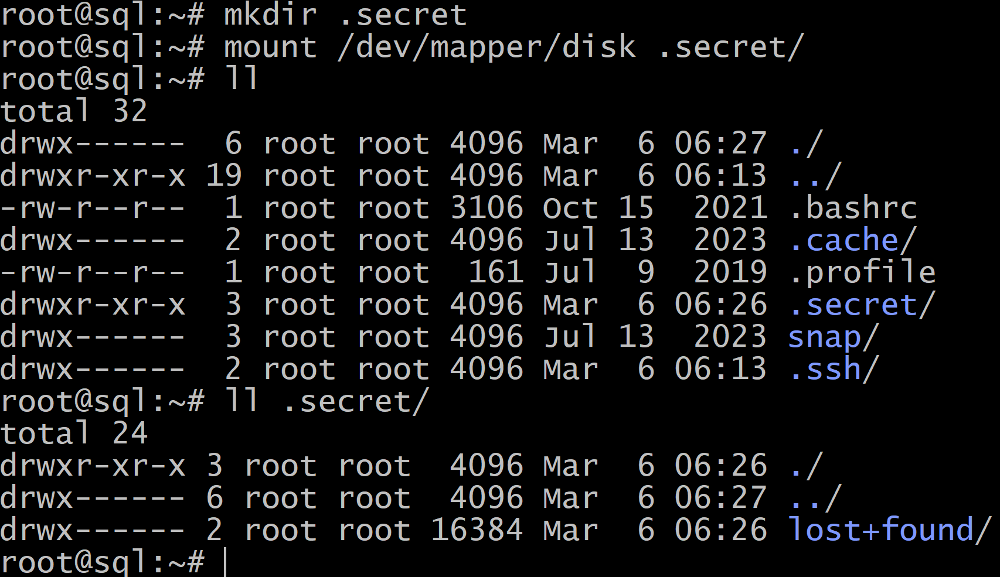

# Домашнее задание к занятию  «Защита хоста» - Илларионов Дмитрий

### Задание 1

1. Установите **eCryptfs**.
2. Добавьте пользователя cryptouser.
3. Зашифруйте домашний каталог пользователя с помощью eCryptfs.


*В качестве ответа  пришлите снимки экрана домашнего каталога пользователя с исходными и зашифрованными данными.*  

#### Решение

* установил:

```
apt install ecryptfs-utils
```
Создал пользователя:

```
adduser --encrypt-home cryptouser
```



Переключаемся на пользователя:


Просмотр домашнего каталога:


Полезная информация:


Пока не примонтируем - нет доступа к домашнему каталогу:


Монтируем:

```
ecryptfs-mount-private
```


Интересно, что что бы получить доступ нужно было выполнить команду CD заново:


Или еще в чем-то причина была не понятно.

В общем можно зайти в шифрованную папку создать файл и содержимое:


Выходим из пользователя возвращаемся в root:


И ничего не видим - файла 123 нет.

Еще попытки что-то найти в других папках:


Все зашифровано - следов нет.


### Задание 2

1. Установите поддержку **LUKS**.
2. Создайте небольшой раздел, например, 100 Мб.
3. Зашифруйте созданный раздел с помощью LUKS.

*В качестве ответа пришлите снимки экрана с поэтапным выполнением задания.*

Смотрю какие есть разделы сейчас:


Создал новый раздел (старый ужал на 1 Gb что бы место было):


в df -h -не отображается:


Хотя уже и так установлен, но, пробую установить:


Проверяем версию:


Настраиваем шифрование на созданном разделе:


Открываем (подготавливаем к рабоете) зашифрованный раздел:


Заполняем нулями новый раздел - вычищаем мусор (для безопасности):


В "зашифрованном слое" внутри создаем файловую систему - размечаем диск:


Создаю папку и примонтирую содержимое раздела в нее:


Теперь что-то запишем в свой файл:


Теперь завершим работу с данными:


Хоть мы и отмонтировали раздел от паппки:


Но, данные еще доступны на чтение в расшифрованном виде:


Удается что-то прочитать:


Поэтому закрываем "соединение" с разделом:


После этого прочитать уже нельзя:


Что бы потом опять прочитать - опять выполняем:


И т.д.

## Дополнительные задания (со звёздочкой*)

Эти задания дополнительные, то есть не обязательные к выполнению, и никак не повлияют на получение вами зачёта по этому домашнему заданию. Вы можете их выполнить, если хотите глубже шире разобраться в материале

### Задание 3 *

1. Установите **apparmor**.
2. Повторите эксперимент, указанный в лекции.
3. Отключите (удалите) apparmor.


*В качестве ответа пришлите снимки экрана с поэтапным выполнением задания.*


